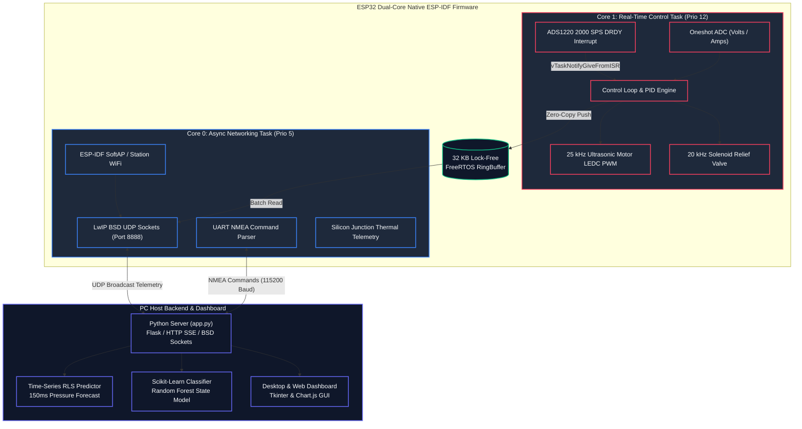

# Balloon Intelligent Pump (BIP)

[](https://docs.espressif.com/projects/esp-idf/)
[](LICENSE)
[]()

**Balloon Intelligent Pump (BIP)** is an industrial-grade, high-precision automated telemetry and measurement framework designed to analyze the mechanical and viscoelastic properties of latex balloons and inflatable elastomeric materials.

Featuring **smart material yield detection**, **controlled destruction burst testing**, **Recursive Least Squares (RLS) time-series forecasting**, and **real-time lock-free UDP telemetry**, BIP bridges the gap between basic pneumatic inflation and scientific material characterization.

---

## 📸 System Architecture



---

## 🌟 Key Technical Features

### ⚡ Native ESP-IDF & FreeRTOS Dual-Core Architecture
- **Hardware Interrupt Synchronization:** ADS1220 24-bit ADC `DRDY` GPIO interrupt triggers direct task notification (`vTaskNotifyGiveFromISR`) unblocking Core 1's `control_task` at **2000 SPS with microsecond precision** and zero polling jitter.
- **32 KB Lock-Free RingBuffer:** Uses native ESP-IDF `ringbuf.h` for zero-copy data passing between Core 1 (Control/DSP) and Core 0 (Network Sockets).
- **25 kHz Ultrasonic Hardware PWM:** Motors and solenoid valves run on ESP-IDF LEDC hardware timers at **25 kHz / 20 kHz**, eliminating human-audible motor whine and reducing MOSFET switching heat.
- **Internal Silicon Junction Thermal Telemetry:** Monitors MCU junction temperature (`driver/temperature_sensor.h`) to detect thermal stress under heavy motor loads.

### 🧠 Time-Series ML & Material Analytics
- **Recursive Least Squares (RLS) Predictive Engine:** Dynamically models viscoelastic balloon expansion curves and forecasts pressure 150ms ahead.
- **Predictive Burst Safety Cutoff:** Automatically halts pump output if forecasted pressure exceeds 95% of estimated material burst limits.
- **Smart Yield Detection:** Monitors sliding window pressure gradients ($dP/dt$), detecting first material yield points and inflating to configurable multiples (e.g., $1.20 \times \text{Yield}$).
- **Cubic Fatigue Index:** Tracks material stress-strain work accumulation ($\text{Stress}^3 \cdot dt$) to display real-time balloon health degradation and remaining elastic reserve percentage.

### 🧪 Bare-MCU Unity Unit Testing Suite
- **Hardware-Free Testing:** Runs Unity unit tests (`#include "unity.h"`) directly on a bare ESP32 board over standard USB-UART without requiring physical pumps, valves, or external ADCs.
- **Automated Validation:** Tests PID loop stability, soft-start PWM ramping, 3-sample inrush overcurrent filters, undervoltage lockouts, and NVS serialization.

---

## 🌿 Git Branching Strategy

| Branch | Platform / Architecture | Key Characteristics |
| :--- | :--- | :--- |
| **`espidf`** *(Current Default)* | **Native ESP-IDF v5.x / C++** | FreeRTOS Dual-Core Tasks, 32KB RingBuffer, 25kHz LEDC PWM, NVS storage, Unity Unit Test suite. |
| **`arduino`** | **Arduino Framework / C++** | Standard `.ino` sketch compatibility for Arduino Nano / Uno / simple setups. |

---

## 📂 Directory Layout

```text
BalloonInteliPump/
├── CMakeLists.txt              <-- Root ESP-IDF CMake build script
├── sdkconfig.defaults          <-- ESP-IDF defaults (240MHz CPU, FreeRTOS 1000Hz, WDT)
├── .gitignore                  <-- Git build exclusion rules
├── components/                 <-- ESP-IDF custom component folder
├── main/                       <-- ESP-IDF Core Component (app_main)
│   ├── CMakeLists.txt          <-- Main component register
│   ├── bip_config.h            <-- Pinout assignments, PWM frequencies, protocol structs
│   ├── bip_sensors.h / .cpp    <-- SPI ADS1220 driver, ADC oneshot driver & Tare baseline
│   ├── bip_motor.h / .cpp      <-- 25 kHz LEDC hardware PWM driver & safety limits
│   ├── bip_storage.h / .cpp    <-- NVS storage manager
│   ├── bip_state.h / .cpp      <-- PID controller & state machine
│   └── main.cpp                <-- FreeRTOS dual-core task runner (app_main)
├── test/                       <-- ESP-IDF Unity Unit Test Component
│   ├── CMakeLists.txt
│   ├── test_main.cpp           <-- Unity test runner
│   ├── test_bip_sensors.cpp    <-- Sensor calibration & Tare tests
│   ├── test_bip_motor.cpp      <-- Motor ramping & safety lockout tests
│   ├── test_bip_state.cpp      <-- PID controller & yield tests
│   └── test_bip_storage.cpp    <-- NVS serialization tests
├── server/                     <-- Python HTTP Server & RLS Time-Series ML Backend
│   └── app.py
├── gui/                        <-- Python Tkinter Desktop Control Panel
│   └── app.py
├── docs/                       <-- BOM, Wiring Schematics & Manuals
└── README.md
```

---

## 🛠️ Build & Flash Instructions

### Prerequisites
- [ESP-IDF v5.x Toolchain](https://docs.espressif.com/projects/esp-idf/en/latest/esp32/get-started/) installed.
- Python 3.10+ virtual environment for desktop tools.

### 1. Build and Flash Firmware (ESP-IDF)
```bash
# Ensure you are on the espidf branch
git checkout espidf

# Build the firmware binary
idf.py build

# Flash to ESP32 board and monitor logs over USB-UART
idf.py -p COM3 flash monitor
```

### 2. Run Unity Unit Tests on Bare ESP32 MCU
```bash
# Flash and run Unity tests over standard USB-UART (No external hardware needed)
idf.py -p COM3 test monitor
```

### 3. Launch Python Dashboard & Telemetry Backend
```bash
# Activate virtual environment
source .venv/bin/activate  # Or .venv\Scripts\Activate.ps1 on Windows

# Launch HTTP Web Server & RLS Predictor
python server/app.py

# Launch Desktop Dashboard App
python gui/app.py
```

---

## 🎮 Command Protocol API

Commands are sent via line-terminated string payloads over USB Serial or UDP socket:

| Command | Description |
| :--- | :--- |
| `CONNECT` | Handshake command to start telemetry transmission. |
| `START_MANUAL` | Switches to Manual control mode. |
| `START_SMART` | Launches automated Yield Point detection inflation. |
| `START_BURST` | Drives pump at 100% capacity until sample destruction. |
| `STOP` | Emergency Stop. Kills PWM outputs and clears active runs. |
| `SET_PWM <0-255>` | Sets direct pump PWM level. |
| `SET_TARGET <kPa>` | Sets manual target pressure for PID closed-loop hold. |
| `SET_RAMP <rate>` | Sets motor soft-start acceleration ramp rate. |
| `VALVE_ON` / `VALVE_OFF` | Fully opens (100%) or seals (0%) solenoid relief valve. |
| `SET_VALVE_PWM <0-255>`| Sets solenoid valve duty cycle for proportional relief. |
| `ZERO_PRESSURE` / `ZERO_TARE` | Zeroes pressure sensor baseline offset on-the-fly. |
| `GET_DIAGNOSTICS` | Returns uptime, free heap, MCU junction temp, and sample counts. |
| `CAL_SAVE` | Commits sensor calibration points to ESP32 NVS flash storage. |

---

## 📊 Telemetry Packet Specification

High-speed NMEA-formatted checksummed telemetry packets stream over UDP/Serial at 100Hz:

```csv
$BIP,Timestamp(ms),Pressure(kPa),PWM,Voltage(V),Current(A),ModeCode,RawP,RawV,RawI*Checksum
```

- **Checksum**: Hexadecimal XOR checksum of all characters between `$` and `*`.
- **Mode Codes**: `0: IDLE`, `1: MANUAL`, `2: SMART`, `3: BURST`, `4: CALIB`, `5: ERROR`.

---

## 📄 License
This project is open-source software licensed under the [MIT License](LICENSE).
