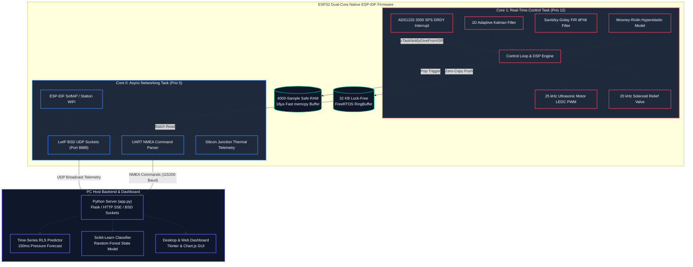

# Balloon Intelligent Pump (BIP)

[](https://docs.espressif.com/projects/esp-idf/)
[](LICENSE)
[]()

**Balloon Intelligent Pump (BIP)** is an industrial-grade, high-precision automated telemetry and measurement framework designed to analyze the mechanical, viscoelastic, hyperelastic, and recreational inflation properties of latex balloons and inflatable elastomeric materials.

Featuring **Mooney-Rivlin hyperelastic stress modeling**, **microsecond burst shock detection**, **smart material yield point detection**, **controlled destruction burst testing**, **dynamic breathing heartbeat pulses**, **rhythmic waveform generation**, **4000-sample Pop Black Box RAM recording**, **Recursive Least Squares (RLS) time-series forecasting**, and **real-time lock-free UDP telemetry**, BIP bridges the gap between pneumatic inflation hardware and scientific material characterization.

---

## 📸 System Architecture



---

## ⚡ Key Technical Features

- **Mooney-Rivlin Hyperelastic Latex Model (`bip_balloon_physics`):** Calculates real-time latex stretch ratio ($\lambda = D/D_0$), hyperelastic strain energy ($W_{\text{Joules}}$), and material yield risk factor.
- **Acoustic & Mechanical Burst Shock Engine:** Detects rapid pressure collapses ($dP/dt < -40\text{ kPa/s}$) to distinguish popping from venting and execute microsecond motor cutoff.
- **Real-Time Balloon Volume & Stretch Estimator (`bip_volume_estimator`):** Continuous integration of air volume ($V_{\text{liters}}$) and estimated balloon diameter ($D_{\text{cm}}$).
- **Microsecond Hardware DRDY Interrupt:** Synced to 2000 SPS ADS1220 24-bit SPI ADC using FreeRTOS Direct Task Notifications (`vTaskNotifyGiveFromISR`).
- **1D Adaptive Kalman Filter:** Zero-phase-lag digital filtering for high-precision pressure readings.
- **Savitzky-Golay 9-Point FIR Derivative Filter:** Computes 1st ($dP/dt$) and 2nd ($d^2P/dt^2$) analytical derivatives for inflection yield detection.
- **4000-Sample Pop Black Box RAM Buffer:** 2.0-second full precision recording (1.5s pre-pop yield + 0.5s post-pop collapse) with <18µs fast `memcpy()` to safe RAM.
- **Dynamic Breathing Heartbeat Mode (`MODE_PULSE`):** Rhythmic $0.1\text{--}2.0\text{ Hz}$ sine pulse generator for living balloon feel with automatic safety relief venting.
- **Rhythmic Waveform Pattern Player (`MODE_PATTERN`):** Plays Sine, Stairs, Triangle, and Crescendo pressure cycles.
- **Automated Hardware Self-Test Engine:** `RUN_SELF_TEST` diagnostic verification of SPI ADC, MCU thermal sensor, and PWM drivers.

---

## 📂 Repository Layout

```text
BalloonInteliPump/
├── CMakeLists.txt              <-- Top-level ESP-IDF build manifest
├── sdkconfig.defaults          <-- ESP-IDF defaults (240MHz CPU, FreeRTOS 1000Hz, WDT)
├── .gitignore                  <-- Git build exclusion rules
├── components/                 <-- ESP-IDF custom component folder
├── main/                       <-- ESP-IDF Core Component (app_main)
│   ├── CMakeLists.txt          <-- Component manifest
│   ├── bip_config.h            <-- Pinout, PWM freqs, 4000-sample RAM buffer size
│   ├── bip_sensors.h / .cpp    <-- SPI ADS1220 driver, Adaptive Kalman Filter & Tare baseline
│   ├── bip_motor.h / .cpp      <-- 25 kHz LEDC hardware PWM driver & safety limits
│   ├── bip_storage.h / .cpp    <-- NVS storage manager
│   ├── bip_state.h / .cpp      <-- FreeRTOS Event Group state machine & waveform generators
│   ├── bip_diagnostics.h/.cpp  <-- Automated hardware self-test engine
│   ├── bip_volume_estimator.h/.cpp <-- Volume (L) and Diameter (cm) estimator
│   ├── bip_balloon_physics.h/.cpp  <-- Mooney-Rivlin hyperelastic model & burst shock engine
│   └── main.cpp                <-- FreeRTOS dual-core task runner (app_main)
├── test/                       <-- ESP-IDF Unity Unit Test Component
│   ├── CMakeLists.txt
│   ├── test_main.cpp           <-- Unity test runner
│   ├── test_bip_sensors.cpp    <-- Sensor calibration & Tare tests
│   ├── test_bip_motor.cpp      <-- Motor ramping & safety lockout tests
│   ├── test_bip_state.cpp      <-- PID controller & yield tests
│   └── test_bip_storage.cpp    <-- NVS serialization tests
├── server/                     <-- Python HTTP Server & RLS Time-Series ML Backend
│   └── app.py
├── gui/                        <-- Python Tkinter Desktop Control Panel
│   └── app.py
├── docs/                       <-- BOM, Wiring Schematics & Manuals
└── README.md
```

---

## 🛠️ Build & Flash Instructions

### Prerequisites
- [ESP-IDF v5.x Toolchain](https://docs.espressif.com/projects/esp-idf/en/latest/esp32/get-started/) installed.
- Python 3.10+ virtual environment for desktop tools.

### 1. Build and Flash Firmware (ESP-IDF)
```bash
# Build the firmware binary
idf.py build

# Flash to ESP32 board and monitor logs over USB-UART
idf.py -p COM3 flash monitor
```

### 2. Run Unity Unit Tests on Bare ESP32 MCU
```bash
# Flash and run Unity tests over standard USB-UART (No external hardware needed)
idf.py -p COM3 test monitor
```

---

## 🎮 Command Protocol API

Commands are sent via line-terminated string payloads over USB Serial or UDP socket:

| Command | Description |
| :--- | :--- |
| `CONNECT` | Handshake command to start telemetry transmission. |
| `START_MANUAL` | Switches to Manual control mode. |
| `START_SMART` | Launches automated Yield Point detection inflation. |
| `START_BURST` | Drives pump at 100% capacity until sample destruction. |
| `START_PULSE` | Activates Dynamic Breathing Heartbeat mode. |
| `SET_PULSE <base> <amp> <freq>` | Configures pulse base pressure (kPa), amplitude, and frequency (Hz). |
| `START_PATTERN` | Activates Rhythmic Waveform Generator. |
| `SET_PATTERN <pat> <min> <max> <period>` | Configures pattern type (`0: Sine, 1: Stairs, 2: Triangle, 3: Crescendo`). |
| `SET_BALLOON_TYPE <0-3>` | Selects balloon preset size (`0: 5", 1: 11", 2: 16", 3: 36"`). |
| `STOP` | Emergency Stop. Kills PWM outputs and clears active runs. |
| `SET_PWM <0-255>` | Sets direct pump PWM level. |
| `SET_TARGET <kPa>` | Sets manual target pressure for PID closed-loop hold. |
| `SET_RAMP <rate>` | Sets motor soft-start acceleration ramp rate. |
| `VALVE_ON` / `VALVE_OFF` | Fully opens (100%) or seals (0%) solenoid relief valve. |
| `SET_VALVE_PWM <0-255>`| Sets solenoid valve duty cycle for proportional relief. |
| `ZERO_PRESSURE` / `ZERO_TARE` | Zeroes pressure sensor baseline offset on-the-fly. |
| `GET_POP_DUMP` | Dumps 4000 full-precision samples (2.0s window @ 2000 SPS) from Safe RAM. |
| `RUN_SELF_TEST` | Runs 5-step automated hardware self-diagnostic test. |
| `GET_DIAGNOSTICS` | Returns uptime, free heap, MCU junction temp, and sample counts. |
| `CAL_SAVE` | Commits sensor calibration points to ESP32 NVS flash storage. |

---

## 📊 Telemetry Packet Specification

High-speed NMEA-formatted checksummed telemetry packets stream over UDP/Serial at 100Hz:

```csv
$BIP,Timestamp(ms),Pressure(kPa),PWM,Voltage(V),Current(A),ModeCode,RawP,RawV,RawI*Checksum
```

- **Checksum**: Hexadecimal XOR checksum of all characters between `$` and `*`.
- **Mode Codes**: `0: IDLE`, `1: MANUAL`, `2: SMART`, `3: BURST`, `4: PULSE`, `5: PATTERN`, `6: CALIB`, `7: ERROR`.

---

## 📄 License
This project is open-source software licensed under the [MIT License](LICENSE).
